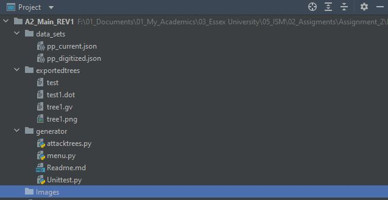
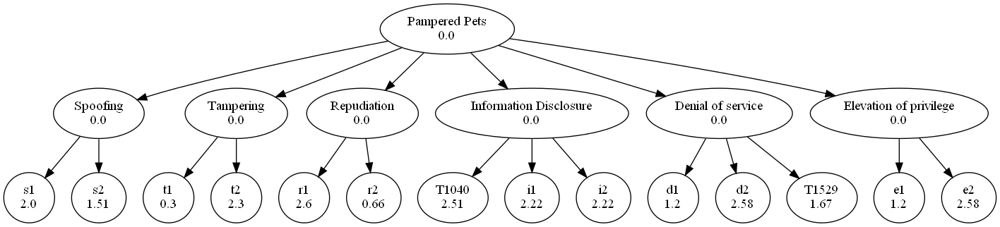

# Welcome to 'The Attack Tree Generator'

## Introduction

This is a **CLI-based** application that provides a risk assessment using customized attack trees. This program performs analysis based on the .json files
provided in it's directory. In addition, a visual attack tree can be generated as .png to the user. 
****
## Features 

This software provides the following features:
   1. Reads uploaded .json files to the directory.
   2. Renders attack trees to the console based on the data provided in the .json file.
   3. Allows users to modify the value of child/leaf nods according the business's threat levels. 
   4. Provides a risk assessment calculation and identifies the overall risk factor.
   5. Exports a .png copy of the attack tree based on the .json data.

****
## Libraries 

The following list of external libraries used in this application:

   - **Json** : .json encoder for python.
   - **cmd** :  command line applications framework.
   - **anytree** : A simple module for attack trees generation that provides Node functions (anytree, 2018).
   - **Graphviz** : A visualization software for exporting trees (Graphviz, 2004). 
   - **os** : Provides functionality needed to allocate file path
****
## Installation 

To run the application, Please follow the steps below:

1. Extract the ZIP file in any directory.
2. The Extracted file should look like this:

3. Download and Install Graphviz from https://graphviz.org/download/
4. Type the following commands in the terminal:

    ~~~
    pip install graphviz
    ~~~
    ~~~
    pip install anytree
    ~~~
    ~~~
    pip install json 
    ~~~
5. To ensure that Graphviz library works as expected, add the path of the installed program at the top of the code: 

    ~~~
    os.environ["PATH"] += os.pathsep + 'C:/Program Files/Graphviz/bin/'
    ~~~
   This ensures that python can access Graphviz executables. 
****
## File Structure 

After extracting the Zip file the following directories will appear

- **data_sets**: Contains the .json files or data.
  - _pp_current.json_: Contains the data of Pampered Pets Business pre-digitization.
  - _pp_digitized.json_: Contains the data of Pampered Pets Business post-digitization.
- **exportedtrees**: Contains the exported .png files from generated trees.
- **generator**: Contains the main .py files.
  - _menu.py_: Contains the cmd commands to navigate the application. 
  - _attacktrees.py_: Contains the main functions to run and analyse the data.
  - _Unittest.py_: Contains the test cases for the application .
- **Images**: Contains screenshots. 

****
## Running the application & Outputs
### Navigating The Commands

**Step 1:** Place your .json data in "data_sets" directory or use any of the existing .json files. An example .json file will be used for these instructions.

 - In order to create the main root, rood nodes and leaf nodes of the tree, the json data should like this:"
   - **main root node**
     ~~~
      "root": {
       "name": "main threat",
       "parent": "None",
       "value":null
     ~~~
    - **root node**
     ~~~
      "leaf1": {
       "name": "sub threat name",
       "parent": "main threat",
       "value":null
     ~~~
**Step 2:** Run the _menu.py_ file, copy  the .json file presented on the output and past it in the console. Chose the file you would like to analyse. Output: 
 ~~~
========== Welcome to The Attack Tree Generator, Current Data files in directory: ==========
pp_current.json
pp_digitized.json
Please type a file name from the list above or type ext to terminate the program
~~~
**Step 3:** A function menu will appear, type any of the commands from the list to operate the data 

 ~~~
========== Insert one of the following commands: ==========
    plt = Plots the tree in the console.
    rsk = Evaluates the risk of the current loaded file. 
    ins = Inserts new Values for the tree leaves
    prn = provides a .png image of the tree
    ext = Terminates program 
 ~~~
**Step 4:** The _plt_ command generates a tree on the console based on the json data, here is an example:
 ~~~
 Node('/Open Safe', value=0.0)
├── Node('/Open Safe/Pick Lock', value=0.0)
├── Node('/Open Safe/Learn Combo', value=0.0)
│   ├── Node('/Open Safe/Learn Combo/Find Written Combo', value=0.5)
│   └── Node('/Open Safe/Learn Combo/Get Combo From Target', value=0.0)
│       ├── Node('/Open Safe/Learn Combo/Get Combo From Target/Threaten', value=0.5)
│       ├── Node('/Open Safe/Learn Combo/Get Combo From Target/Blackmail', value=0.0)
│       ├── Node('/Open Safe/Learn Combo/Get Combo From Target/Eavesdrop', value=0.0)
│       │   ├── Node('/Open Safe/Learn Combo/Get Combo From Target/Eavesdrop/Listen to Conversation', value=0.2)
│       │   └── Node('/Open Safe/Learn Combo/Get Combo From Target/Eavesdrop/Get Target to State Combo', value=0.5)
│       └── Node('/Open Safe/Learn Combo/Get Combo From Target/Bribe', value=0.2)
├── Node('/Open Safe/Cut Open Safe', value=2.0)
└── Node('/Open Safe/Install Improperly', value=5.0)
 ~~~
**Step 5:**  The _rsk_ command calculates the total risk value of the selected .json data, here is an example:
 ~~~
   Total Risk value is: 1.25, Total Threat Rate Low Risk.
 ~~~
**Step 6:**  The _ins_ command allows the user to assign a new value for the leaf nodes provided in the list, here is an example:
 ~~~
----------
root
----------
----------
Pick Lock
----------
----------
Learn Combo
----------
----------
Find Written Combo
----------
----------
Get Combo From Target
----------
----------
Threaten
----------
----------
Blackmail
----------
----------
Eavesdrop
----------
----------
Listen to Conversation
----------
----------
Get Target to State Combo
----------
----------
Bribe
----------
----------
Cut Open Safe
----------
----------
Install Improperly
----------
Please input leaf node name from above or press 'Enter' For main menu
 ~~~

**Step 7:**  Finally _prn_ command allows the user to export a .png file of the tree, it is recommended to run the rsk command to get main 
root evaluation in the exported tree. below is an example:

_If the exported tree is not showing the prefered results, delete the "temp" file present the app directory_

**_Please refer to the Executive summery report for more understanding on the risk evluation criteria_**
https://github.com/TarekHamzaGoda/05_Module_5_ISM_AUG23/tree/main/02_Assignment_Part_2

****
## Test Libraries and Test Cases

### Testing libraries used in this application:

   - **Unittest** : Python's testing library (Python, 2023). 
   - **mock** :  testing mockups of user inputs( Python, 2023). 
   
### Testing Cases used in this application:

1. Check if the user typed the correct .json file:
 ~~~
    @patch('builtins.input', return_value="data_sets/pp_current.json")
    def Inserted_Files(self, input):
 ~~~
2. Check if the .json file is correct and can plot the tree on the screen:
 ~~~
    @patch('builtins.input', return_value="tree_test")
    def Plotting_trees(self, input):
 ~~~
2. Check if the risk values is as expected:
 ~~~
    @patch('attaktrees.nodes', data_test) 
    @patch('attacktress.root_node', data_root)  
    def Risk_Calc(self):
 ~~~

****
## References

Graphviz, 2004. Graphviz. [Online] 
Available at: https://graphviz.org/

Python, 2023. unittest.mock — mock object library. [Online] 
Available at: https://docs.python.org/3/library/unittest.mock.html
[Accessed 09 09 2023].

anytree, 2018. Any Python Tree Data. [Online] 
Available at: https://anytree.readthedocs.io/en/latest/
[Accessed 01 09 2023].

****
